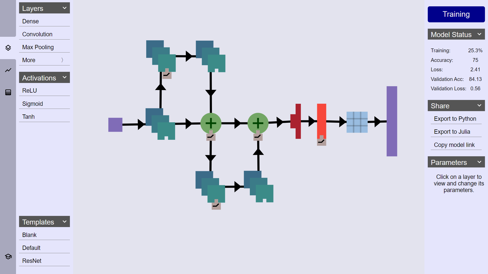

# ENNUI
ENNUI is an Elegant Neural Network User Interface that allows users to:
- Build neural network architectures with a drag and drop interface.
- Train those networks on the browser.
- Visualize the training process.
- Export to Python.

Thanks to Gil Strang, it's hosted at [https://math.mit.edu/ENNUI/](https://math.mit.edu/ENNUI/)

# Installation
After cloning the repo, to install dependencies, run:
`npm install`

To Build the app, run:
`npm run build`

For Continuous Build and Integration, run:
`npm run watch`

To use chrome with localhost and the CIFAR-10 Dataset, make sure to close
all chrome windows and run the following command to launch chrome:
'path/to/chrome.exe --allow-file-access-from-files'

# Code Structure
ENNUI is frontend-only. The implementation is structed in two parts:
- `ENNUI/src/ui` is home to the traditional frontend components such as the styling, the button logic, and the draggable components (e.g. the layers and activations).
- `ENNUI/src/model` is the "backend" implementation supporting core functionality such as building neural networks, doing the code generation, and saving the state in the browser. 
